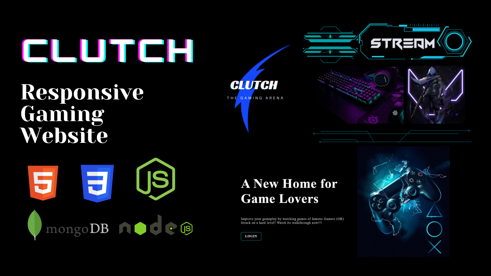
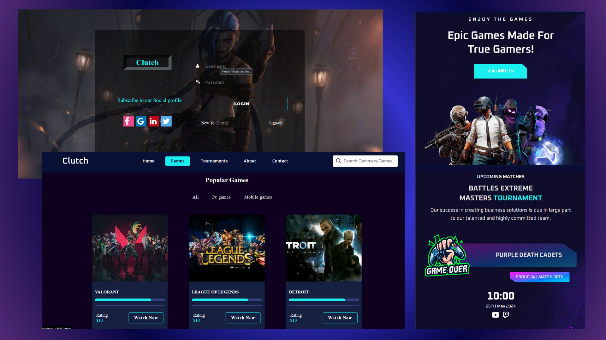

<h1 align="center">Clutch - eSports Gaming Website</h1>

  Clutch is a fully responsive esports gaming website,  Responsive for all devices, build using HTML, CSS, JavaScript, Node and Express.
   It is a full stack project with Login-Sign up Authentication and a Database managing all the infos of users 
    using Mongodb Software.

  <a href="https://drive.google.com/file/d/1SVDIiMAaQmKjGyExLLkCK-LfzR-Sdg-h/view?usp=sharing"><strong>➥ Live Demo</strong></a>

 

### Demo Screeshots

